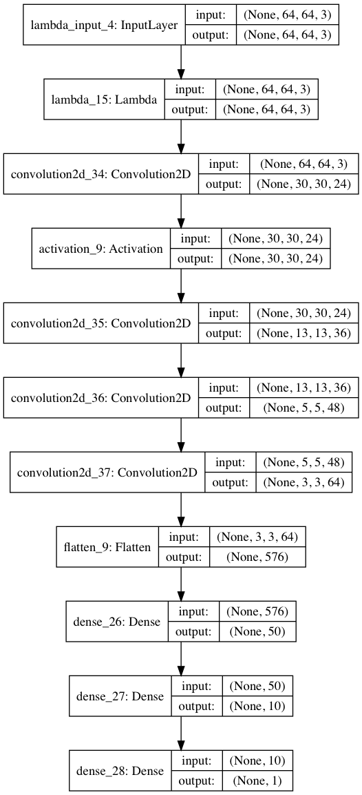

# Behavioral Cloning Project

---

The goals / steps of this project are the following:
* Use the simulator to collect data of good driving behavior
* Build, a convolution neural network in Keras that predicts steering angles from images
* Train and validate the model with a training and validation set
* Test that the model successfully drives around track one without leaving the road
* Summarize the results with a written report

---

## Preamble

The meaning of the term 'Behavioral Cloning' could be more clearly communicated by replacing it with 'Behavioral Mimicking' or 'Monkey See Monkey Do'.

The goal of a 'Behavioral Cloning' machine learning system is to observe input samples and associated actions
to learn the desired action for a given input.
A well trained system can then be applied to similar inputs.
In this project, the input is images captured from a driving simulator and the action to be mimicked is the steering angle.

This project could have been approached as a classification problem (with enough classes to provide 
	fine grained response)
However, it would be better to produce a continuous output value, hence the project is approached as a 'regression' problem.

The referenced Nvidia model is used as the starting point for the deep learning network architecture.

The provided simulator produces images of dimension width x height = 160x320.
There is a top horizontal band above the road surface that does not provide driving information and can be cropped.
Also, there is a bottom horizontal band with the car's hood that can be cropped.
Reducing input size will reduce the number of parameters that need to be trained.

## Architecture

The starting point used for the model architecture is the network described in the Nvidia paper 
[End to End Learning for Self-Driving Cars](http://images.nvidia.com/content/tegra/automotive/images/2016/solutions/pdf/end-to-end-dl-using-px.pdf)

The Nvidia model takes input images of dimensional shape (66, 200, 3). Nvidia uses 3 input channels coded in YUV format.
Surprisingly, the Nvidia model does not use pooling or dropout layers, and we follow suit to start with.

We have observed that there is a top and bottom horizontal band that can be cropped without losing driving information.
In addition, there is a broad road surface area that doesn't provide much feature information,
it is the road edge feature information that is relevant.
It appears that the simulator image can thus be reduced in width without greatly affecting relevant input information.
With cropping and resizing of width, input images with dimensional shape (64, 64, 3) seems reasonable.
The much smaller input image size affects the resulting architecture.

The Nvidia model has 5 convolutional layers. 
With 5 convolutional layers for input image dimensions of 64x64 and the kernel and stride configurations used,
the fifth layer output dimension would be 1x1. This seems degenerate, so the fifth layer is dropped.

The Nvidia model has 3 fully connected layers.
The flattened layer has 1164 elements, whereas the model used has a flattened layer of 576 elements,
so it seems reasonable to drop the fully connected layer with 100 elements, and going straight to the 50 element layer.

The reduced image input size means much fewer parameters need to be trained,
resulting in shorter training cycles and allows more experimentation on the model.

The resulting model architecture is shown in the model below:



### Model Configuration (Compilation)

Optimizer used: [Adam (adaptive moment estimation)](https://arxiv.org/abs/1412.6980v8)
Adam "computes individual adaptive learning rates for different parameters from estimates of first and second moments of the gradients"
Adam optimizer default parameter values were used.

The steering angle output is addressed as a regression problem, so the loss used is 'mean squared error'.

## Training

Generator: avoids loading entire data set.

### Data Used

Lacking gaming skills to guide the car smoothly around the track, the Udacity provided dataset was used.

### Initial Results

Initially only ran model on 1 epoch to ensure the code was valid.
Surprisingly, running the resulting model, the car made it past the bridge. 
(Although it failed to negotiate the left turn after the bridge, and went off the road to the right.)

### Data Augmentation

Adding data was enough to overcome overfitting, and the trained model successfully guided the car around the track.

### Model Variations

#### L2 Regularization
Low train and validation loss, but car smashed up against left side of bridge.

#### Dropout
On input layer.
Car successful in negotiating track. Doesn't seem better than without dropout layer

## Overfitting
Data, dropout, regularization, batch normalization, bears, oh my!

## Postamble
Explore transfer learning models provided by Keras.
Explore simplest network that would work.

Epoch 1/10
6428/6428 [==============================] - 57s - loss: 0.4139 - val_loss: 0.0166
Epoch 2/10
6428/6428 [==============================] - 49s - loss: 0.0124 - val_loss: 0.0155
Epoch 3/10
6428/6428 [==============================] - 55s - loss: 0.0115 - val_loss: 0.0150
Epoch 4/10
6428/6428 [==============================] - 51s - loss: 0.0112 - val_loss: 0.0144
Epoch 5/10
6428/6428 [==============================] - 48s - loss: 0.0111 - val_loss: 0.0146
Epoch 6/10
6428/6428 [==============================] - 59s - loss: 0.0107 - val_loss: 0.0142
Epoch 7/10
6428/6428 [==============================] - 51s - loss: 0.0106 - val_loss: 0.0137
Epoch 8/10
6428/6428 [==============================] - 51s - loss: 0.0105 - val_loss: 0.0132
Epoch 9/10
6428/6428 [==============================] - 50s - loss: 0.0104 - val_loss: 0.0138
Epoch 10/10
6428/6428 [==============================] - 56s - loss: 0.0105 - val_loss: 0.0132

Validation loss levels out at epoch 7
whereas training loss keeps dropping,
so starting to overfit at epoch 8.

First Iteration
* 10 epochs on center image
* test drive results: went through bridge, started wavering, went off road right side into tires.

Second Iteration
* add left and right camera images to handle situations when car is off center
* 

Epoch 1/10
19284/19284 [==============================] - 162s - loss: 3.2441 - acc: 0.1467 - val_loss: 0.0232 - val_acc: 0.1816
Epoch 2/10
19284/19284 [==============================] - 151s - loss: 0.0164 - acc: 0.1807 - val_loss: 0.0208 - val_acc: 0.1816
Epoch 3/10
19284/19284 [==============================] - 148s - loss: 0.0148 - acc: 0.1807 - val_loss: 0.0190 - val_acc: 0.1818
Epoch 4/10
19284/19284 [==============================] - 156s - loss: 0.0139 - acc: 0.1807 - val_loss: 0.0165 - val_acc: 0.1818
Epoch 5/10
19284/19284 [==============================] - 154s - loss: 0.0133 - acc: 0.1807 - val_loss: 0.0154 - val_acc: 0.1818
Epoch 6/10
19284/19284 [==============================] - 148s - loss: 0.0129 - acc: 0.1807 - val_loss: 0.0150 - val_acc: 0.1818
Epoch 7/10
19284/19284 [==============================] - 148s - loss: 0.0126 - acc: 0.1807 - val_loss: 0.0151 - val_acc: 0.1818
Epoch 8/10
19284/19284 [==============================] - 151s - loss: 0.0124 - acc: 0.1807 - val_loss: 0.0154 - val_acc: 0.1818
Epoch 9/10
19284/19284 [==============================] - 151s - loss: 0.0121 - acc: 0.1807 - val_loss: 0.0159 - val_acc: 0.1818
Epoch 10/10
19284/19284 [==============================] - 150s - loss: 0.0119 - acc: 0.1807 - val_loss: 0.0160 - val_acc: 0.1818

steering left right image correction
0.1
0.2
0.3 off to left before bridge

Multiple Iterations later
* add flipped images
* add left and right images (angle adjustment 0.15) ( < 0.1 is not enough, >0.2 overcorrects)
* batch size 128
* learning rate 0.001
* epochs 6

Iteration: augmented with flipped left/right, did not seem to make a diff in driving

Iteration: L2 regularization conv and dense layers W_regularizer=l2(0.01)
* loss converges to low number
* stuck on left side bridge

Iteration: dropout


---

[//]: # (Image References)

[image1]: ./examples/placeholder.png "Model Visualization"
[image2]: ./examples/placeholder.png "Grayscaling"
[image3]: ./examples/placeholder_small.png "Recovery Image"
[image4]: ./examples/placeholder_small.png "Recovery Image"
[image5]: ./examples/placeholder_small.png "Recovery Image"
[image6]: ./examples/placeholder_small.png "Normal Image"
[image7]: ./examples/placeholder_small.png "Flipped Image"

## Rubric Points
###Here I will consider the [rubric points](https://review.udacity.com/#!/rubrics/432/view) individually and describe how I addressed each point in my implementation.  

---
###Files Submitted & Code Quality

####1. Submission includes all required files and can be used to run the simulator in autonomous mode

My project includes the following files:
* model.py containing the script to create and train the model
* drive.py for driving the car in autonomous mode
* model.h5 containing a trained convolution neural network 
* writeup_report.md or writeup_report.pdf summarizing the results

####2. Submssion includes functional code
Using the Udacity provided simulator and my drive.py file, the car can be driven autonomously around the track by executing 
```sh
python drive.py model.h5
```

####3. Submssion code is usable and readable

The model.py file contains the code for training and saving the convolution neural network. The file shows the pipeline I used for training and validating the model, and it contains comments to explain how the code works.

###Model Architecture and Training Strategy

####1. An appropriate model arcthiecture has been employed

My model consists of a convolution neural network with 3x3 filter sizes and depths between 32 and 128 (model.py lines 18-24) 

The model includes RELU layers to introduce nonlinearity (code line 20), and the data is normalized in the model using a Keras lambda layer (code line 18). 

####2. Attempts to reduce overfitting in the model

The model contains dropout layers in order to reduce overfitting (model.py lines 21). 

The model was trained and validated on different data sets to ensure that the model was not overfitting (code line 10-16). The model was tested by running it through the simulator and ensuring that the vehicle could stay on the track.

####3. Model parameter tuning

The model used an adam optimizer, so the learning rate was not tuned manually (model.py line 25).

####4. Appropriate training data

Training data was chosen to keep the vehicle driving on the road. I used a combination of center lane driving, recovering from the left and right sides of the road ... 

For details about how I created the training data, see the next section. 

###Model Architecture and Training Strategy

####1. Solution Design Approach

The overall strategy for deriving a model architecture was to ...

My first step was to use a convolution neural network model similar to the ... I thought this model might be appropriate because ...

In order to gauge how well the model was working, I split my image and steering angle data into a training and validation set. I found that my first model had a low mean squared error on the training set but a high mean squared error on the validation set. This implied that the model was overfitting. 

To combat the overfitting, I modified the model so that ...

Then I ... 

The final step was to run the simulator to see how well the car was driving around track one. There were a few spots where the vehicle fell off the track... to improve the driving behavior in these cases, I ....

At the end of the process, the vehicle is able to drive autonomously around the track without leaving the road.

####2. Final Model Architecture

The final model architecture (model.py lines 18-24) consisted of a convolution neural network with the following layers and layer sizes ...

Here is a visualization of the architecture (note: visualizing the architecture is optional according to the project rubric)

![alt text][image1]

####3. Creation of the Training Set & Training Process

To capture good driving behavior, I first recorded two laps on track one using center lane driving. Here is an example image of center lane driving:

![alt text][image2]

I then recorded the vehicle recovering from the left side and right sides of the road back to center so that the vehicle would learn to .... These images show what a recovery looks like starting from ... :

![alt text][image3]
![alt text][image4]
![alt text][image5]

Then I repeated this process on track two in order to get more data points.

To augment the data sat, I also flipped images and angles thinking that this would ... For example, here is an image that has then been flipped:

![alt text][image6]
![alt text][image7]

Etc ....

After the collection process, I had X number of data points. I then preprocessed this data by ...


I finally randomly shuffled the data set and put Y% of the data into a validation set. 

I used this training data for training the model. The validation set helped determine if the model was over or under fitting. The ideal number of epochs was Z as evidenced by ... I used an adam optimizer so that manually training the learning rate wasn't necessary.