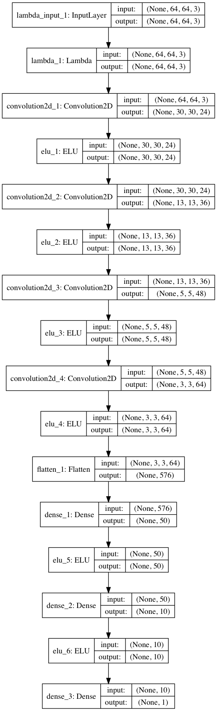
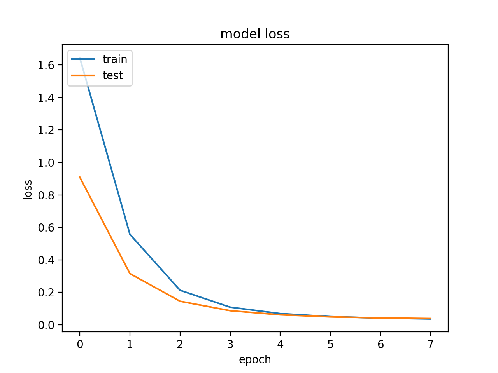

# Behavioral Cloning Project

---

The goals / steps of this project are the following:
* Use the simulator to collect data of good driving behavior
* Build, a convolution neural network in Keras that predicts steering angles from images
* Train and validate the model with a training and validation set
* Test that the model successfully drives around track one without leaving the road
* Summarize the results with a written report

---

###Files Submitted & Code Quality

####1. Submission includes all required files and can be used to run the simulator in autonomous mode

My project includes the following files:
* model.py containing the script to create and train the model
* drive.py for driving the car in autonomous mode
* model.h5 containing a trained convolution neural network 
* writeup_report.md summarizing the results

####2. Submssion includes functional code
Using the Udacity provided simulator and my drive.py file, the car can be driven autonomously around the track by executing 
```sh
python drive.py model.h5
```

####3. Submssion code is usable and readable

The model.py file contains the code for training and saving the convolution neural network. The file shows the pipeline I used for training and validating the model, and it contains comments to explain how the code works.


## Preamble

The meaning of the term 'Behavioral Cloning' could be more clearly communicated by replacing it with 'Behavioral Mimicking' or 'Monkey See Monkey Do'.

The goal of a 'Behavioral Cloning' machine learning system is to observe input samples and associated actions
to learn the desired action for a given input.
A well trained system can then be applied to similar inputs.
In this project, the input is images captured from a driving simulator and the action to be mimicked is the steering angle.

This project could have been approached as a classification problem (with enough classes to provide 
	fine grained response)
However, it would be better to produce a continuous output value, hence the project is approached as a 'regression' problem.

The referenced Nvidia model is used as the starting point for the deep learning network architecture.

The provided simulator produces images of dimension width x height = 160x320.
There is a top horizontal band above the road surface that does not provide driving information and can be cropped.
Also, there is a bottom horizontal band with the car's hood that can be cropped.
Reducing input size will reduce the number of parameters that need to be trained.

## Architecture

The starting point used for the model architecture is the network described in the Nvidia paper 
[End to End Learning for Self-Driving Cars](http://images.nvidia.com/content/tegra/automotive/images/2016/solutions/pdf/end-to-end-dl-using-px.pdf)
This is a proven starting point that works for more complex real world situations.

The Nvidia DAVE2 model is a convolutional neural network.
Convolutional neural networks consists of two main types of layers:
1. convolutional layers at the front end of the network serve as feature detectors.
2. fully connected layers at the back end serve as classifiers.

The Nvidia model takes input images of dimensional shape (66, 200, 3). Nvidia uses 3 input channels coded in YUV format.
Surprisingly, the Nvidia model does not use pooling or dropout layers, and we follow suit to start with.

We have observed that there is a top and bottom horizontal band that can be cropped without losing driving information.
In addition, there is a broad road surface area that doesn't provide much feature information,
it is the road edge feature information that is relevant.
It appears that the simulator image can thus be reduced in width without greatly affecting relevant input information.
With cropping and resizing of width, input images with dimensional shape (64, 64, 3) seems reasonable.
The much smaller input image size affects the resulting architecture.

The Nvidia model has 5 convolutional layers. 
With 5 convolutional layers for input image dimensions of 64x64 and the kernel and stride configurations used,
the fifth layer output dimension would be 1x1. This seems degenerate, so the fifth layer is dropped.

The Nvidia model has 3 fully connected layers.
The flattened layer has 1164 elements, whereas the model used has a flattened layer of 576 elements,
so it seems reasonable to drop the fully connected layer with 100 elements, and going straight to the 50 element layer.

The reduced image input size means much fewer parameters need to be trained,
resulting in shorter training cycles and allows more experimentation on the model.

The resulting model architecture is shown in the model below:



Or in text form:
```
____________________________________________________________________________________________________
Layer (type)                     Output Shape          Param #     Connected to                     
====================================================================================================
lambda_8 (Lambda)                (None, 64, 64, 3)     0           lambda_input_8[0][0]             
____________________________________________________________________________________________________
convolution2d_35 (Convolution2D) (None, 30, 30, 24)    1824        lambda_8[0][0]                   
____________________________________________________________________________________________________
elu_48 (ELU)                     (None, 30, 30, 24)    0           convolution2d_35[0][0]           
____________________________________________________________________________________________________
convolution2d_36 (Convolution2D) (None, 13, 13, 36)    21636       elu_48[0][0]                     
____________________________________________________________________________________________________
elu_49 (ELU)                     (None, 13, 13, 36)    0           convolution2d_36[0][0]           
____________________________________________________________________________________________________
convolution2d_37 (Convolution2D) (None, 5, 5, 48)      43248       elu_49[0][0]                     
____________________________________________________________________________________________________
elu_50 (ELU)                     (None, 5, 5, 48)      0           convolution2d_37[0][0]           
____________________________________________________________________________________________________
convolution2d_38 (Convolution2D) (None, 3, 3, 64)      27712       elu_50[0][0]                     
____________________________________________________________________________________________________
elu_51 (ELU)                     (None, 3, 3, 64)      0           convolution2d_38[0][0]           
____________________________________________________________________________________________________
flatten_8 (Flatten)              (None, 576)           0           elu_51[0][0]                     
____________________________________________________________________________________________________
dense_21 (Dense)                 (None, 50)            28850       flatten_8[0][0]                  
____________________________________________________________________________________________________
elu_52 (ELU)                     (None, 50)            0           dense_21[0][0]                   
____________________________________________________________________________________________________
dense_22 (Dense)                 (None, 10)            510         elu_52[0][0]                     
____________________________________________________________________________________________________
elu_53 (ELU)                     (None, 10)            0           dense_22[0][0]                   
____________________________________________________________________________________________________
dense_23 (Dense)                 (None, 1)             11          elu_53[0][0]                     
====================================================================================================
Total params: 123,791
Trainable params: 123,791
Non-trainable params: 0
____________________________________________________________________________________________________
```

### Model Configuration (Compilation)

**Optimizer** used: [Adam (adaptive moment estimation)](https://arxiv.org/abs/1412.6980v8)
Adam "computes individual adaptive **learning rates** for different parameters from estimates of first and second moments of the gradients"
Adam optimizer default parameter values were used.
Using the Adam optimizer alleviates manual adjustment of learning rate during system training.

The steering angle output is addressed as a regression problem, so the loss used is 'mean squared error'.

## Training

### Data Used

Lacking gaming skills to guide the car smoothly around the track, the Udacity provided dataset was used.

This data is split into training and validation datasets using as split ratio of 4-to-1 train vs validation.
Or 80% training, 20% validation.

The validation set is used to evaluate the trained model and
helped determine if the model was over or under fitting.

The data samples is shuffled during training.

### System limitations

Generators are used to load batches of data (image files) from disk,
this avoids loading entire datasets into memory, likely exceeding main memory limits.

### Initial Results

Initially only ran model on 1 epoch to ensure the code was valid.

Once the code is confirmed to successfully execute, 
the model was trained for 10 epochs to evaluate training and validation loss.

Surprisingly, running the resulting model, the car made it past the bridge. 
(Although it failed to negotiate the left turn after the bridge, and went off the road to the right.)

The results show that with each epoch, the training loss went down, whereas the validation loss has a slow increasing trend.
The losses are plotted in the accompanying figure, 


This indicates that the model is **overfitted**.
The approaches for **addressing overfitting** include:

1. use more training data
2. various options in modifying the model, including dropout, pooling, weights regularization.

Various data scientists including Andrew Ng have stated that one key to making deep learning techniques work is enough data.
[Datasets Over Algorithms](https://www.edge.org/response-detail/26587)

So to address overfitting, the first inclination is to add to the training dataset.

### Data Augmentation

The initial dataset can be transformed in various ways to add to the training data.

1. Flip the images (and the steering angle)
2. Left and Right Camera Views as Corrections.

#### Left and Right Camera Images Usage
The simulator captures images from 3 cameras: left, center, right. The accompanying steering angle corresponds to the center camera.
The left and right camera views are captured from a viewpoint roughly 3 feet to either side of center.

Example:
  

The center image has steering angle 0.
The left image can be seen as a car that has drifted to the left, so it needs to be steered back towards center with: `left_angle = center_angle + correction`

Similarly in opposite direction for the right image.

The steering angle range is -1 to 1, corresponding to -25 to 25 degrees.
The amount of correction is up for experimentation, too little and car drifts off road, too much and the car over-corrects and swerves off road. 
The correction settled on is 0.2

#### Data size
Using these 2 techniques together, the resulting sample size is 6 times original size.
A total of 38568 samples.

#### Improved performance with Data
With this data set, the training and validation loss decrease over subsequent epochs as seen in this plot: 

As was eventually seen after various trials,
adding data was enough to overcome overfitting, and the trained model successfully guided the car around the track.

### Model Variations

Various architectural options was used to modify the initial model to investigate possible improvements.
These trials are summarized in this section.

#### L2 Regularization
L2 regularization is used to adjust weights to a more even range, no high variance in weights and can be used to address overfitting.
The resulting training and validation loss look promising, the losses drop and converge.
This is plotted here: 

However, with L2 regularization, the car smashed up against left side of bridge.
Further investigation on root cause is needed.

#### Dropout
Dropout is tried after initial input layer and after the first convolutional layer.
Using the trained model, the car wassuccessful in negotiating track,
but the behavior did not seem better than without dropout layer

#### Maxpool size 2x2, stride 2x2
Max-pooling was tried after the 1st Convolutional 2D layer.
Because of the dimensionality reduction of max-pooling,
the first convolutional stride was reduced from 2,2 to 1,1.

The resulting trained model allowed the car to make it around the course, but car weaved around road some.

### Dropout, regularization, batch normalization, bears, oh my!
There are many options each with it's own set of dimensions for modifying the architecture.
Clearly there are too many options to experiment with in one project.
The best approach is to use proven prior work as starting points.
The Nvidia DAVE2 model is used is this project, there are many more.

### Epochs

During the trials, the loss was generally seen to level out after the 5th or 6th epoch.

## PostAmble

A successful model found in this project was the initial architecture based on the Nvidia DAVE2 model.
It used an augmented data set created from the Udacity provided data set.

The car was driven on the simulator for over half an hour,
the car does not end up smoking on a pile of tires.

This architecture does not have pooling or dropout layers.
This empirical finding is congruous with the Nvidia DAVE2 model.

The project results shows a simplified Nvidia model can be used to address a simplified environment of the simulator.

### Futures

There are many directions to explore including:

1. Convert RGB to YUV. This separates color from whether the scene is light or dark.
2. Explore other models including transfer learning models provided by Keras.
3. Explore what is simplest network that would work.
